# 3D Reconstruction Basic

## 0. 写在前面

每次写点什么东西之前，我总喜欢创造出来一个第零章。在这个文档笔记中，还是以巩固基础为主吧，无论是相机模型还是那些老的传统重建方法，我想都有可能是未来某个idea的灵感来源，因此巩固基础可能才是重中之重。可能也会有实践，会在实现后补充在下面，那就开始吧。

## 1. 相机模型基础

为了将真实物体记录到相片上，胶片诞生，但随之而来的问题上，是真实物体的点不能与胶片上的点一一对应，就像这样：

因此添加针孔，因此来阻断某些点在散射出过滤掉某些光线，使其只能通过一组光线，这就是小孔成像的基本原理，那其构成的图片，也如下图所示：

因此，在小孔（即光圈）较大时，就会导致阻挡的光线组变少，大量的冗余光线进入光圈，致使胶片上的某一点由多束光线掺杂起来，形成重叠或交叠，但同时，亮度也会变低。如下图所示：

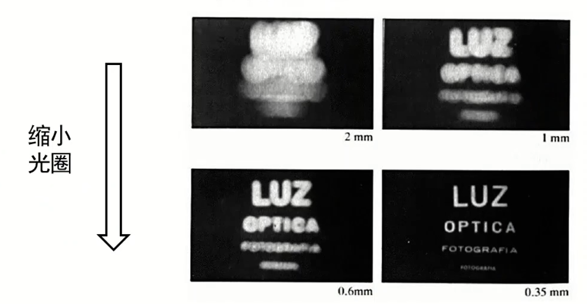

因此，如何利用好一个点发射出的多束光线形成一个明亮而清晰的点就成了关键问题。

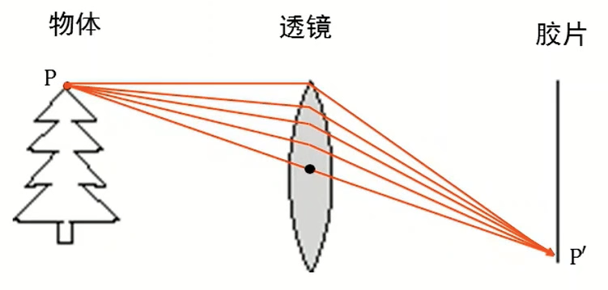

 

因此在透镜模型中，空间点到像素坐标系的映射关系就是这样表示：

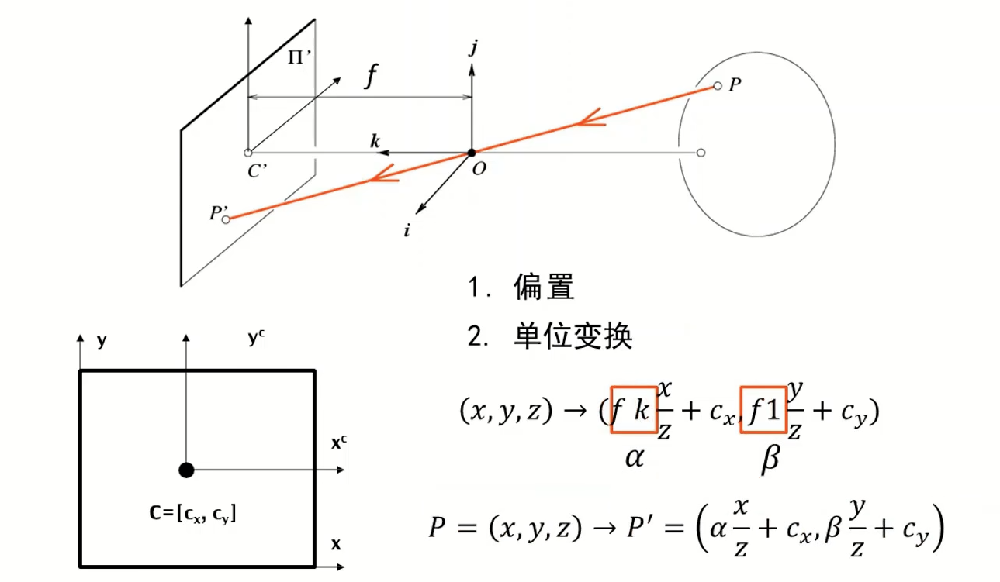

其中，由于空间点的基坐标系与常用的像素坐标系的关系具有偏差，因此进行了常量的偏置，同时又因为单位的不统一，产生了比例系数，用于分别等同于横纵坐标的两个转换系数（pixel-m）

但由于z的存在，导致真实坐标与像素坐标之间的转换关系并非线性，因此引入其次坐标系。

欧式距离转换为齐次坐标系的变换为下图：

齐次坐标转换为欧式坐标的变换如下图：

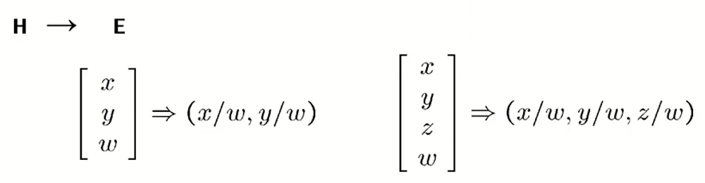

因此齐次坐标系下，真实坐标与像素坐标之间的转换关系如下所示：其实就是标定的矩阵。

考虑像素坐标系存在畸变的情况， 

因此，M为投影矩阵，前三列构成了内参矩阵K

实际上，为了更好的表述客观物体，需要建立一个世界坐标系，来准确的描述真实世界中各个点的坐标位置。在将世界坐标系中的点转换到相机坐标系（需要注意的是，在之前我们描述真实物体时，采用的坐标系是相机坐标系

）时，需要考虑矩阵变换的形式，通常是以一个旋转矩阵和一个平移矩阵搞定的，这一部分可以参考我手眼标定的那个环节。

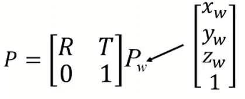

## 2. 单视图测量

### 2.1 2D变换类型：

1.等距变换：3DOF的平面平移变换

 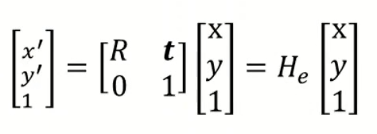

2.相似变换：3+1DOF的平面缩放变换（加入缩放矩阵S）

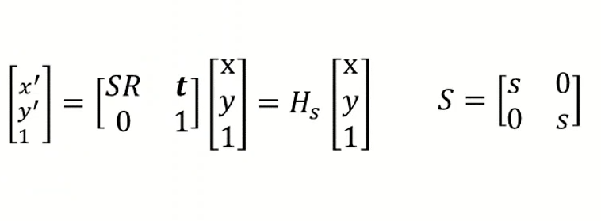

3.仿射变换：2x2+2DOF的平面非比例缩放变换(平行关系、面积比值保持，角度大小变换)

4.影射变换：2x2+2+2的变换（共线性与四共线点的交比不变）

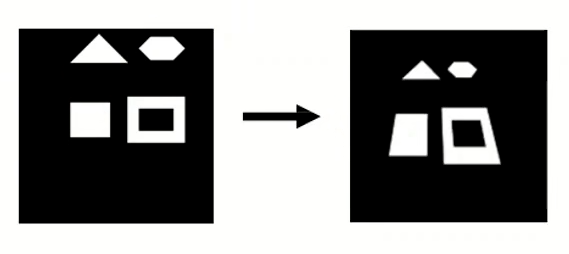

什么是交比呢：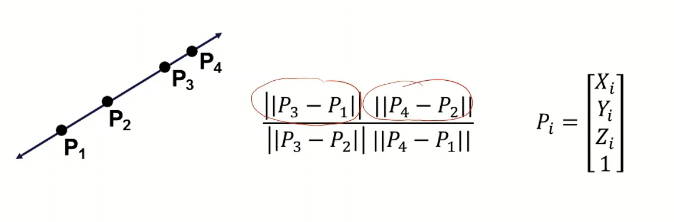

### 2.2 影消点与影消线

### ***二维表示:***

直线的交点用齐次坐标形式表示：

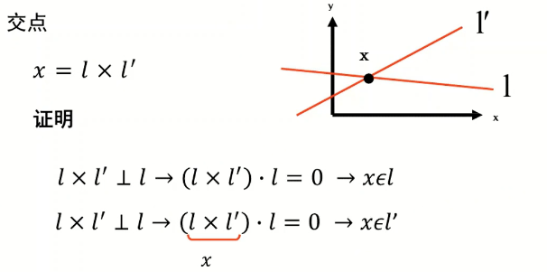

复习下点乘与叉乘的用途各自是什么吧，点乘的意义很简单，就是进行向量之间元素的运算，计算的结果是一个标量。

叉乘就是计算两个向量所在平面的法向量，计算的结果是一个向量，也就是法向量。

然后就是**无穷远点**，在2D的表示中，如果齐次坐标的第三位为0，那么就说明该点是一个无穷远点。同时，这个无穷远点也是两条平行线的交点：证明方法就是利用lx=0即可。

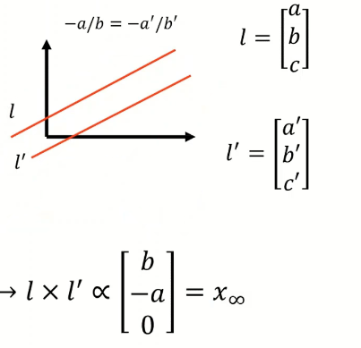

那么所有的无穷远点，都位于**无穷远直线**上，其表示为：

**无穷远点的变换**：无穷远点经过透视变换将不再是一个无穷远点，而经过仿射变换后依旧是一个仿射变换。

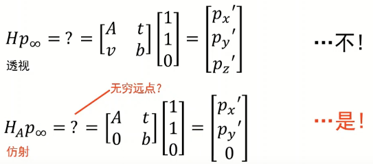

**无穷远线的变换**：对于一条直线的变换，存在变换与原线的这样的关系：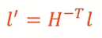

同样，对于无穷远线的透视变换，使其不再是一个无穷远线；而经过仿射变换后，仍旧是一条无穷远线。

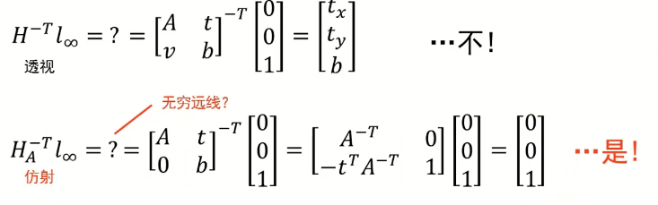

### ***三维表示:***

空间中的线的表示方法由两个平面的交线表示，

无穷远点仍旧是两条平行线的焦点，按二维的表示法，则是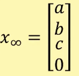

影消点：无穷远点再图像平面的投影点

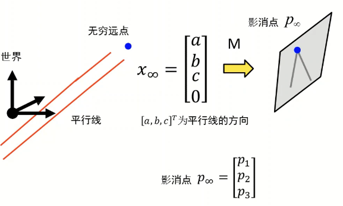

实际上就是一个实际的无穷远点，因为投射变化，变成了在二维图像中有形状的点。就行一条笔直的公路被拍下来。

那么，对于一个样例如图所示：

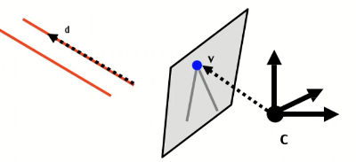

无穷远点与影消点的关系由推导可知：

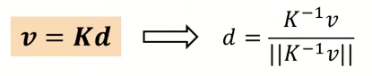

那么很好判断的就是，影消线是影消点的集合，我们找到了影消点自然就知道了影消线的位置，那么我们就可以根据这条线，来确认整个平面的法向量，其中，K为相机的内参矩阵。

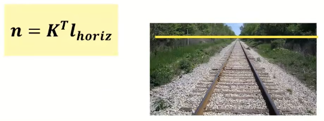

同时，也可以确认由影消点来确认两组平行线之间的夹角：

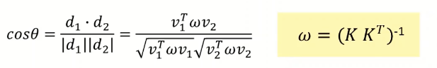

### 2.3 单视图重构

 

单视图的标定大概就是这么一个流程，重点是获得相机的内参矩阵K，可以注意的是图像中的v1v2v3三个影消点是来自于三维空间中正交的三组平行线选出的，因此才能够获得左下角括号里的三个为0的方程组。

标定结束之后，就可以通过影消线来获取每个平面对应的法向量了，获得了法向量就相当于得到了整个平面。

## 3 三维重建

### 3.1 重建基础

由于单目难以实现比例的确认，即无法识别近大远小造成的透视比例，而人眼却能够分辨出所谓的“视觉魔术”，因此，为了解决这样的问题，通常采用双目相机或两个相机来实现单张图片的重建工作。其原理图如下：

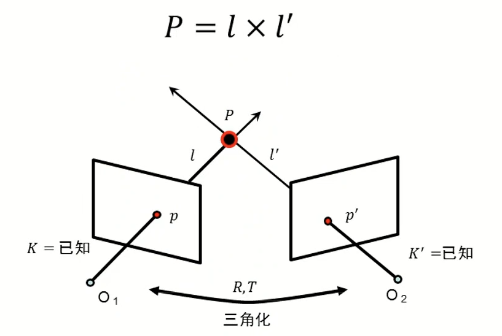

通常，问题的已知是p与p‘的两张成像点坐标，K与K’平面，以及两个相机之间的RT矩阵，通过这些来求解最终的P点坐标。为了解决这个问题，通常是计算P*，即假定的三维坐标点，我们通过将这个三维坐标点重投影到相机的成像平面上，来计算实际投影坐标与P*投影坐标之间的差值，最小的点即是最终的实际点P。效果如下：

### 3.2 极几何

极几何的目的是为了描述两个相机之间的成像与实际物体的位置关系，通常是为了统一同一物体在两个相机坐标系的位置表达。

几个定义：

极平面：过点P，O1，O2的平面。

基线：O1与O2的连线。

极线：极平面与成像平面的交线pe

极点：基线与成像平面的交点

还有一个定义是关于本质矩阵E：

关于本质矩阵E，存在这样的性质：

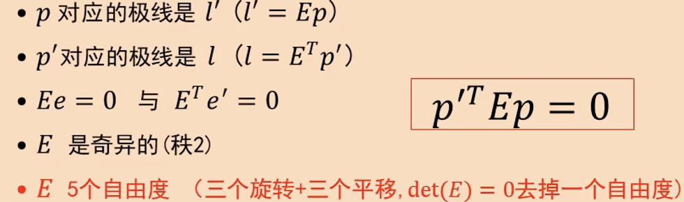

本质矩阵实际上是理想情况下的极坐标表述，但这为我们提供了一种思路，在处理普通相机问题时，我们只需要将其处理为理想情况即可。

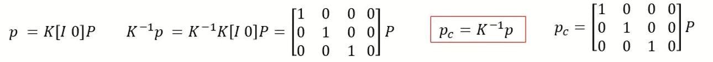

随后带入

即可，同样，基础矩阵也具有这样的性质。

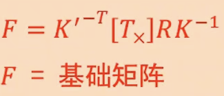

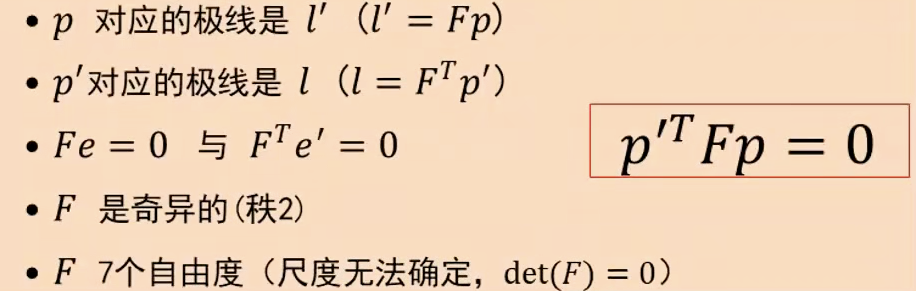

### 3.3 基础矩阵估计

八点算法来估计F矩阵

就是因为需要解决F的七个自由度问题。方法的本质就是在两个视图上选择物体的相同点，在两个成像平面上的不同坐标来确定F矩阵。

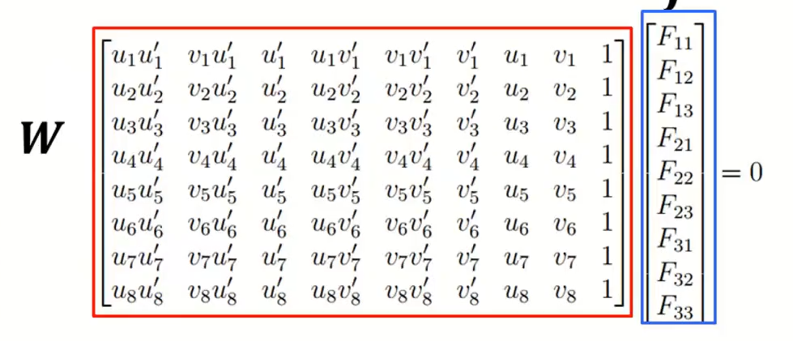

通常，为了提高F的精度，会选择大于八个点来提升算法的鲁棒性。但这样得到的也仅仅是Fhat，不是最终的F矩阵，因为F的定义是奇异矩阵，不满秩，因此需要对其进行奇异值分解。

为了解决精度不足的问题，常用归一化的八点法，即：

### 4.1 平行视图的深度估计

在日常生活中，由于我们多使用双目相机而非分体相机去估计深度，因此这里着重介绍一下平行试图的深度估计方法。

在这里首先需要知道一个先验知识，即平行视图中，同一点在两个成像平面上的坐标表达，仅在u轴上存在区别，与上图所表达的内容一致。这就使平行视图的深度估计任务更加简单。

在这张图像中，我们可以根据相似三角形获得这样的结果：

即什么呢，我们只需要知道pu-pu‘，就能知道这张图片的深度图了，由于这个值又叫视差，所以深度图又叫做视差图。

### 4.2 非平行视图的平行视图变换方法：

第一步：在两张图片中选取一组对应点，一共要大于等于8组，计算F矩阵。

第二步：根据第一步获得的基础矩阵，计算两个图像的极点位置。

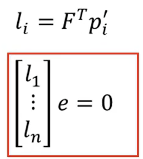

第三步，使用透射变换H‘将e’映射到无穷远点（f，0，0）

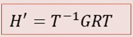

第四步，获取对应透视变换矩阵H使得下式最小：

第五步，对新的矩阵H与H‘，对原图进行重新采样。

### 4.3 对应点搜索

相关匹配法：

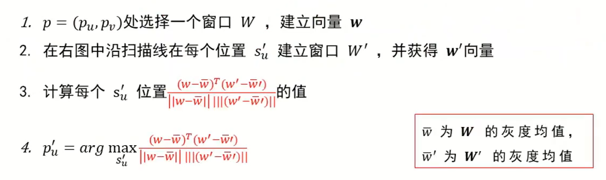

为了降低匹配法的错误率，需要为这种方法增加多种约束：唯一性约束，顺序约束，平滑性约束