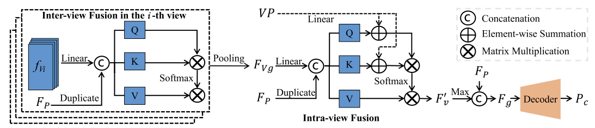
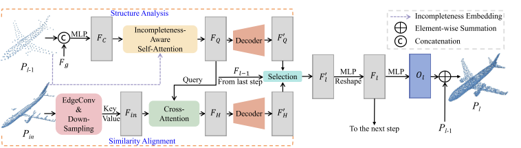
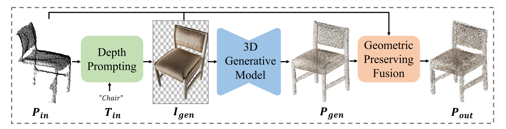
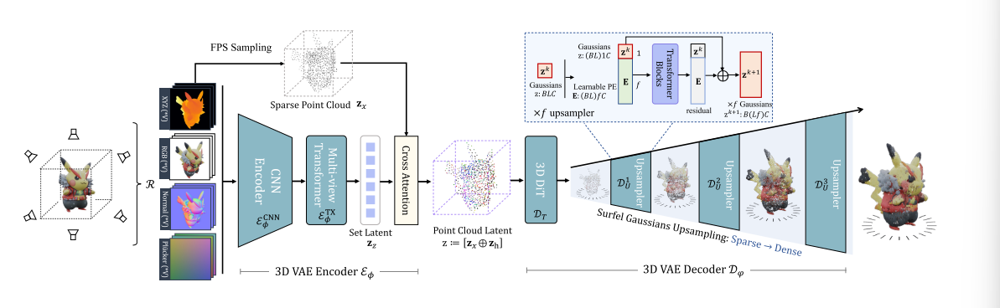
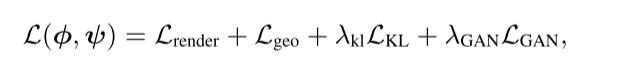

# 3D 点云补全方法

## SVDFormer_PointSea [IJCV 2025]

3 Step：

### 1.不完全点云通过投影，获得了类似于三视图的深度图像。

### 2.三维点云通过三个集合抽象层的 PointNet++ 获取三维点云特征$F_P$，三视图通过一个基于ResNet-18的网络获得三视图特征$F_v$，将两个特征通过FeatureFusion，获取一个基础的点云骨架。

FeatureFusion的pipeline为：

****

其中，$f_{Vi}$作为第一个自注意力机制的输入，原文提到是patch-wise feature，通过第一次最大池化获得优化后的三视图图像的特征，随后和SVDFormer相同。又通过了一个自注意力机制，去强化第一个自注意力机制强化后的图像特征，最后输出的$F^{'}_v$通过最大池化层，并继续点云特征$F_P$关联，最后通过解码，获得完整的稀疏点云$P_0$。

### 3.SDG的pipeline

分为上下两层，上层为结构分析，下层为相似度对齐，使得$P_{in}$与$P_{i-1}$得到组合特征$F_l$，包含源自学习的形状先验，与从 Pin 中找到的类似几何模式中学习得到的。通过O1再获取一层偏移量，加到$P_{i-1}$中，生成新一轮的基础模型。重复两次。

与SVDFormer不同的是，加入了Selection模块，目的是原来是直接将两个拼接起来，但是：

***然而，在不同的缺失区域，这两个单元的重要性也不尽相同。例如，在某些缺失区域，由于对称性等特性，输入观测点的几何形状几乎完全相同。在这种情况下，"相似性对齐 "单元中的信息对这些点的作用更大。受此启发，本文通过路径选择模块整合了这两种特征类型，并自适应地选择了更为关键的特征。***

## GenPC [CVPR 2025]

### Depth Prompting

在恢复为$D_{raw}$时，作者对点云采样时选择了订点采样，并使用了B的隐点去除策略，选择了convex hull上点最多的视角如Draw。随后，在获得$D_{raw}$后，使用了一个基于Diffusion的预训练2D补全模型，对$D_{raw}$进行了inpainting，获得$D_{c}$,随后使用ControlNet进行了图像生成。

### 3D Generative Model

image-to-3D

### Geometric Preserving Fusion

通过调整Pgen的缩放尺度，不断与Ppartical进行ICP，对齐结果生成Pall，但其实是要区分Ppartical和Pmiss部分的。

随后将二者分别初始化为3DGS，partical不训练，miss训练，通过计算partical在Vscan视角下render的RGB和Depth通过补全模型Zero123的生成图与Gall的SDS损失，对miss部分进行优化；随后为了降低对partical部分的改动，又加入了一个Gall和Gpartical之间的MSE损失计算。

## GaussianAnything [ICLR 2025]

1.训练目标

1）训练Encoder，使输入的RGB-D-N图像对应到Point Cloud Latent

2）一个条件级联的transformer去噪器，在给定条件与步长的情况下对latent noise去噪

3）一个Decoder用于将Point Cloud Latent 还原到3DGS

