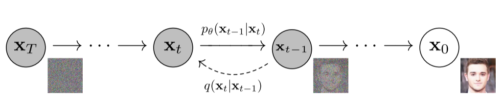
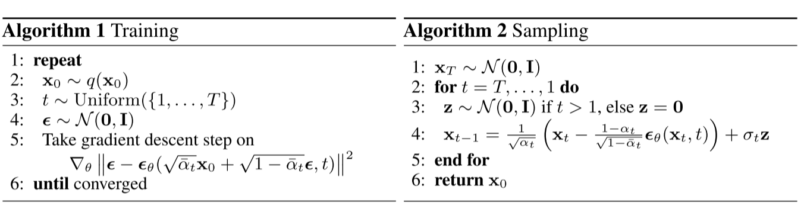
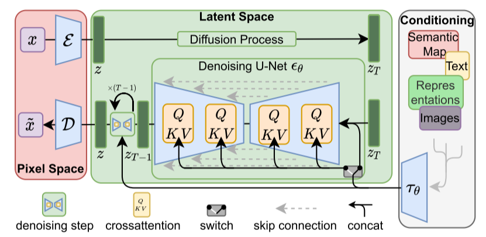
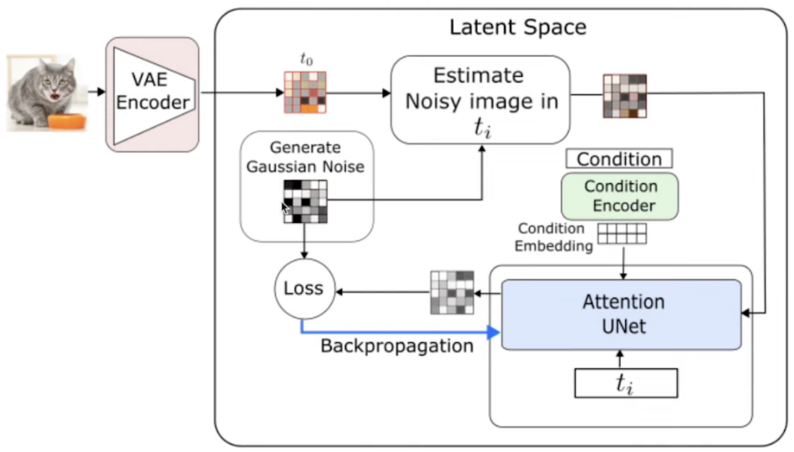
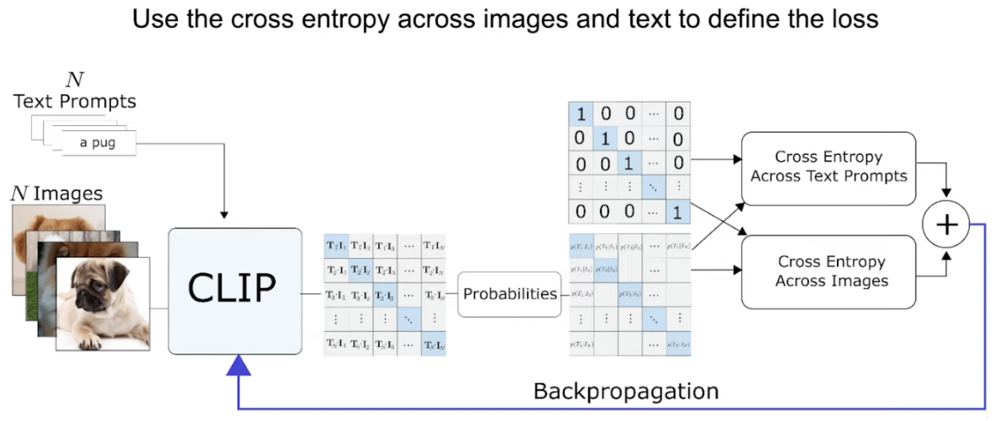
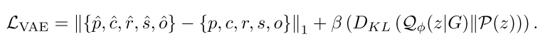
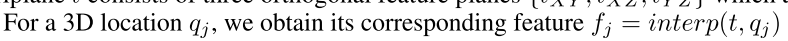
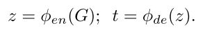

# DDPM+LDM+VAE+DiffGS Learning Note

## 1.Pipeline

文章采用的主要结构一共有三点，一个是使用Latent Diffusion Model的VAE结构；一个是把原高斯公式解耦成了三个表示，GauPF(概率)、GauCF(颜色)、GauTF(变换)；最后通过这三个函数再通过一种基于八叉树的优化算法，生成精确的高斯基元中心位置。

## 2.Latent Diffusion Model

### 2.1 Denoising Diffusion Probabilistic Models(DDPM)

这篇文章是Diffsion的基础模型，分为两个过程，前向过程（forward process）与反向过程（reverse process）二者都是一个参数化的马尔科夫链。实际上，RNN（循环神经网络）就是一个马尔可夫过程，其含义就是当前时刻的状态实际上是与过去时刻有关的，且当前的状态是保留着过去状态的，如下图所示。

#### 2.1.1 Forward Process

从DDPM的示意图可以看出，前向过程就是一个通过对数据逐渐增加高斯噪音直至数据变成随机噪音的过程。经过T步加噪，对第T-1张图像的处理为：$X_t = f(X_{t-1})$，其中，$f(x) = \sqrt{1-\beta_t}*X_{t-1}+\sqrt{\beta_t}*Z_t$，其中，$Z_t \sim N(0,I)$。由于DDPM马尔科夫链是参数化的，因此我们可以直接获得从第一步到最后一步的加噪，其式如下所示：
$$
X_t = \sqrt{a_ta_{t-1}...a_1}*X_0+\sqrt{1-a_ta_{t-1}...a_1}*Z
$$
通过这样的一步，将直接从原图获取全噪声图像。

#### 2.1.2 Reverse Process

通过第一步的加噪，逆向过程的目的就是通过对于当前图像噪声的预测，对全噪声图进行恢复，通过每一个step实现恢复原图的一个过程，这个预测噪声的，采用了神经网络的方法去完成。与式1同理，逆向过程也可以直接将最后一步恢复为原图，如式2所示，但作者讨论过这样的做法，并不能很好的恢复为原图，因此一步一步来最好。
$$
X_0 = \frac{X_t-\sqrt{1-a_ta_{t-1}...a_1}\tilde{Z}}{\sqrt{a_ta_{t-1}...a_1}}
$$
其中，$\tilde{Z}=UNet(X_t,t)$，其中不知道的就只剩找到T时刻与T-1时刻之间的$f(X_t,\tilde{Z})$就可以指逆向的过程了。

*中间的细节我留个空白在这里，我觉得当前对我是不重要的，以后精度的时候再补充*总之，作者利用重参数化与其他概率方法，得到了最终的公式3。
$$
X_{t-1} = \frac{1}{\sqrt{a_t}}(X_t-\frac{\beta_t}{\sqrt{1-\bar{a_t}}}*\tilde{Z},\frac{1-\bar{a_{t-1}}}{1-\bar{a_t}}*\beta_t)
$$

从这个Sampling就可以看出，$X_T$作为一个新的高斯噪声图，会被输入到reverse process进行处理，从而生成一个新的图片。

#### 2.1.3 不足

对于一个更具有泛化性的模型，一张照片作为训练集图像是不够的，为了提高模型的泛化性，对于图片本身特征的提炼会大幅的加大UNet参数的大小，使模型本身变的臃肿，不仅拖延了训练速度，且使模型注意到了很多无需注意到的细节，浪费了算力资源。

#### 2.1.4 改进

将像素空间的训练转换到latent space中，利用Encoder-Decoder的结构的隐藏层去训练。

### 2.2 VAE

VAE的全称是Variational Auto-Encoders，变分自编码器是对AutoEncoder的一种改善。AE是一种无监督的神经网络，学习了输入数据的特征，然后再利用编码器将特征空间转变为原来的图像。

上图为AutoEncoder的训练过程，本质上是通过自监督的训练过程，将latent space中的特征向量与输入的image对应上，给出一组输入${x_1,x_2....x_t}$就会存在latent space 中对应的特征向量${w_1,w_2....w_t}$，本质上，AE是不具有生成能力的，加入我们给出一个新的latent space中的新的向量$w_n$，是找不到对应的$x$的，因为本质上就是离散的一组数据相互对应，latent space并没有正则化，自然不能找到新的输出与之对应了。

因此VAE对AE进行了改善，Encoder的输出不再是一种离散的数据，而是一种概率分布，因此再训练好对应的Decoder之后，实际上就是找到一种解码概率为图像的一种方法，就具有生成能力了。具体来说，是将固定的特征向量的概率分布逼近规定的标准正态分布，这里VAE利用到了KL散度。

*再留个坑，数学推导还是不太重要，现在先不写了，毕竟只是入门哈哈，以后会填上的。*

### 2.3 LDMs

可以看到，Latent diffusion models 实际上就是再VAE的签空间过程中，加入了DDPM，然后又引入了一个交叉注意力机制来使用多模态引导图像生成。

原理就不讲了，就是上面这几部分拼凑起来，需要注意的是LDM的训练过程是有顺序的：

第一步是训练VAE，使Encoder与Decoder具有编解码latent space的能力；第二步才是训练DDPM的UNet，因为DDPM原始的意义就是将原图加噪、降噪恢复成原图的训练过程，部署为eval模式时，也是输出图片，因此在潜空间中，也是将潜向量恢复/创造潜向量的过程。

最后训练交叉注意力机制：

7ef49e887b3608777581e95df025cdd7

其实到这里就差不多了，DiffGS多的一个环节就是VAE的Decoder换成了一个Triplane Decoder，将潜在向量还原为一个三维的坐标点。然后又有一步拆解为解耦高斯表达最后还原的一步。

### 3.DiffGS Pipeline解读

这里需要理解一下的是，一开始我其实是把E-D这一部分看作是这篇文章的VAE，但实际上这样来看的话，一方面是忽略了后文把三个解耦函数也看作是三个神经预测器了；另一方面是triplane decoder输出的三维坐标系实际上是没有gt和他算loss的。

所以decoder应该一直包括到三个神经预测器和后面的提取为高斯的$\mathcal{L}$。

这是VAE的训练Loss，其中，神经预测器的数据是这样得出的：

然后和LDM一样，生成任务的时候把Decoder冻结住，调整三个神经预测器的工作顺序，就能做出来一个生成的pipeline了。